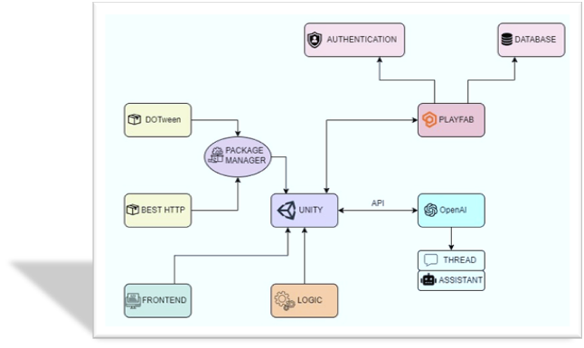

# TrivAI: Trivia Game powered by generative AI

## Project Description:
TrivAI is a cross-platform trivia game that dynamically generates questions using AI. Designed for enhanced replayability, it allows users to select categories and experience fresh trivia every time they play.

## Features
- AI-Generated Trivia Questions: Powered by OpenAI, delivering unique questions each session.
- Cross-Platform Compatibility: Available on mobile and web platforms via Unity.
- Enhanced Replayability: Endless gameplay with personalized trivia categories.

## Technologies Used
- Unity: Game engine for cross-platform development.
- OpenAI: For dynamic question generation.
- PlayFab: For backend services, data storage, and user authentication.

### Structure of the project

### The Authentication Page 
The Authentication Page serves as the entry point for users, designed with engaging visuals and interactive features: 
- Robot Mascot
- Real-Time Validation
- Animations
  

### Setup Page
The Game Setup Screen allows users to tailor their gameplay experience. It features several interactive elements that enhance customization and user engagement.
- With "Custom Categories", users can input their preferred category names, allowing for a personalized trivia experience. Alternatively, "Combined Categories" randomly selects three categories from a diverse pool of 100 options, ensuring variety and excitement with each game session.
- Difficulty Levels
- Game Duration
- Customizable Username
- Help Methods
  

### Gameplay Screen 
The Gameplay Screen is the heart of the "TrivAI" experience. It displays trivia questions and multiple-choice answers, designed to keep users engaged and challenged.

## Credits:
This project was developed by Sandra Cormos.

